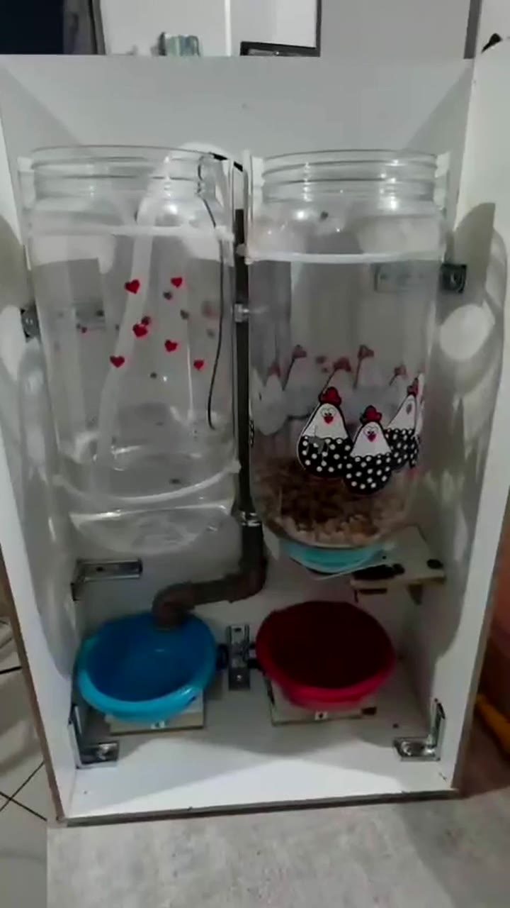
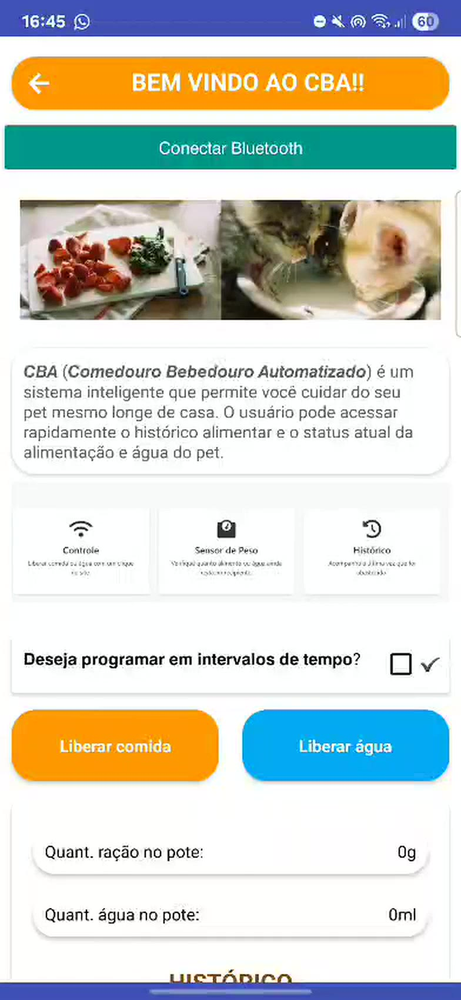
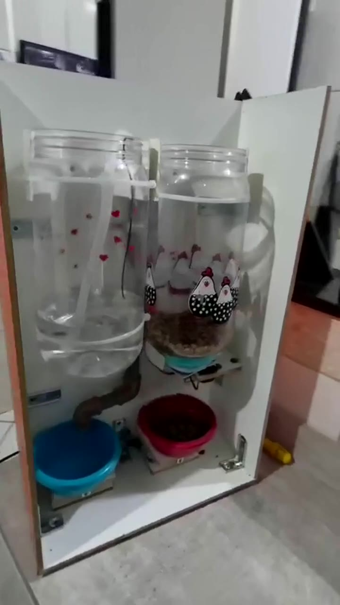
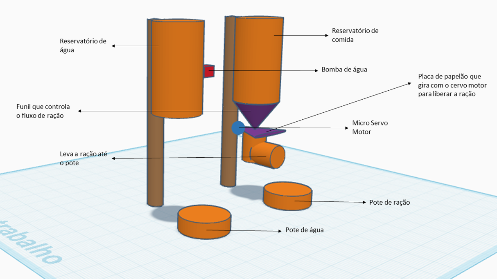
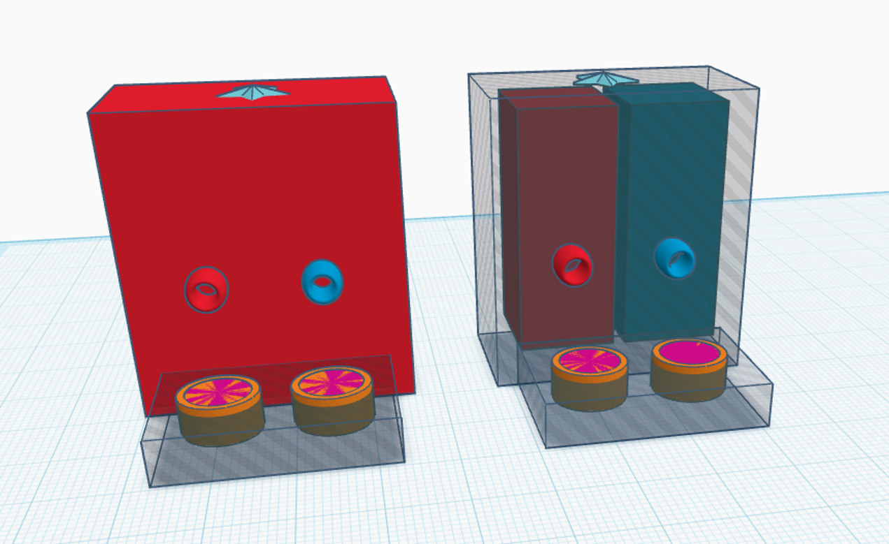
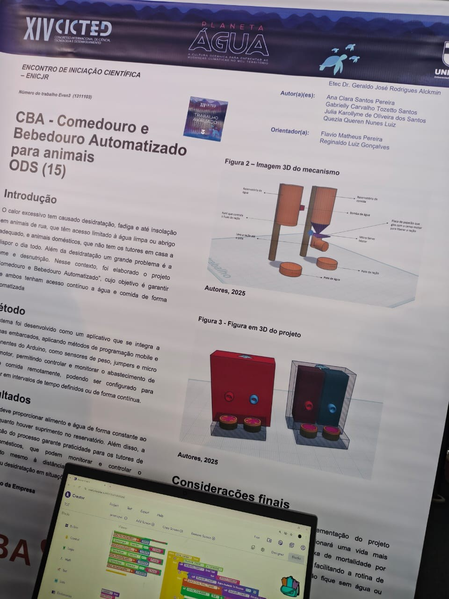
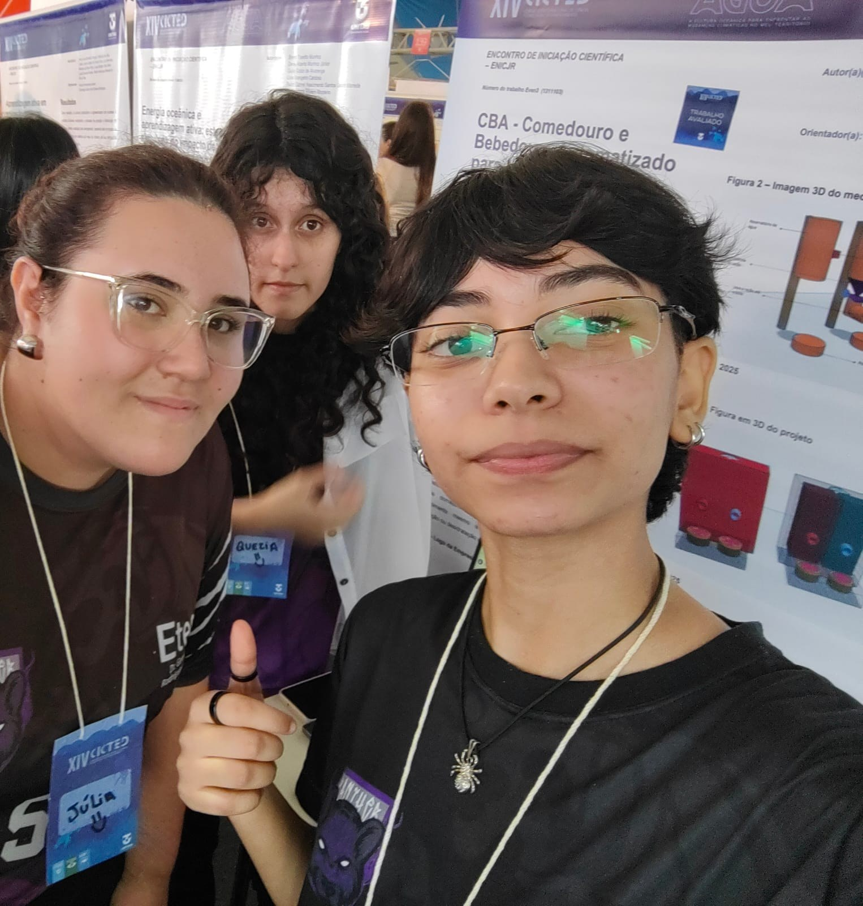

<h1 align="center">
     – Comedouro e Bebedouro Automatizado
</h1>

<p>
  Comedouro e bebedouro automáticos para animais de rua e pets, controlados por um aplicativo de celular.<br>
  Trabalho de Conclusão de Curso da <strong>Etec Dr. Geraldo José Rodrigues Alckmin</strong> (Taubaté, SP), apresentado no <strong>XIV CICTED</strong>.
</p>

<p>
  
  
  
  
</p>


## Sumário

- [O problema](#o-problema)
- [A solução](#a-solução)
- [Veja funcionando](#veja-funcionando)
- [Como funciona](#como-funciona)
- [O aplicativo](#o-aplicativo)
- [Componentes](#componentes)
- [Estrutura do repositório](#estrutura-do-repositório)
- [Como usar](#como-usar)
- [CICTED](#apresentação-no-xiv-cicted)
- [Equipe](#equipe)


## O problema

O calor excessivo causa desidratação, fadiga e até insolação em **animais de rua**, que têm pouco acesso a água limpa e abrigo. E os **pets** também sofrem quando os tutores passam o dia fora e não há ninguém para repor a água e a comida. Além da sede, fome e desnutrição também são um problema.

## A solução

O **CBA** garante que os animais tenham acesso contínuo a água e comida, de forma automática.

- 🍖 **Libera ração e água** pelo aplicativo, na hora que o tutor quiser.
- ⏰ **Programa intervalos**: por exemplo, comida a cada 2 horas e água a cada 4 horas.
- ⚖️ **Mostra quanto tem nos potes**, com sensores de peso (ração em gramas e água em ml).
- 📜 **Guarda um histórico** de quando a comida e a água foram liberadas.

Tudo é controlado à distância pelo celular, conectado ao Arduino por Bluetooth.


## Veja funcionando

Clique nas imagens para assistir aos vídeos.

<table>
  <tr>
    <td align="center" width="33%">
      <a href="midias/videos/funcionando.mp4"></a><br>
      <strong>O protótipo funcionando</strong>
    </td>
    <td align="center" width="33%">
      <a href="midias/videos/aplicativo.mp4"></a><br>
      <strong>O aplicativo</strong>
    </td>
    <td align="center" width="33%">
      <a href="midias/videos/montagem.mp4"></a><br>
      <strong>Por dentro do protótipo</strong>
    </td>
  </tr>
</table>


## Como funciona

<p align="center">
  
</p>

**Água:** o reservatório de água fica em cima. Quando a liberação é acionada, uma **bomba de água** leva a água até o pote.

**Comida:** a ração desce do reservatório por um **funil**. Embaixo dele, uma **placa presa a um micro servo motor** gira para abrir a passagem, e um tubo leva a ração até o pote.

**Controle:** o **Arduino** recebe os comandos do aplicativo por **Bluetooth**, aciona a bomba e o servo, e lê os **sensores de peso** que ficam embaixo dos potes.

<p align="center">
  <br>
  <em>Modelo 3D do projeto: por fora (esquerda) e por dentro (direita)</em>
</p>


## O aplicativo

<table>
  <tr>
    <td align="center"><br><strong>Tela inicial</strong><br>Conectar Bluetooth e liberar comida ou água</td>
    <td align="center"><br><strong>Programar intervalos</strong><br>Escolher de quanto em quanto tempo liberar</td>
    <td align="center"><br><strong>Histórico</strong><br>Quantidade nos potes e últimas liberações</td>
  </tr>
</table>


## Componentes

| Componente | Para que serve |
| --- | --- |
| Arduino | Controla todo o sistema |
| Módulo Bluetooth | Conecta o Arduino ao aplicativo |
| Micro servo motor | Gira a placa que libera a ração |
| Bomba de água | Leva a água do reservatório até o pote |
| Sensores de peso | Medem a quantidade de ração e de água nos potes |
| Reservatórios, funil, tubos e potes | Estrutura que guarda e conduz a comida e a água |
| Jumpers e protoboard | Ligações entre os componentes |


## Estrutura do repositório

```
📁 arduino/        código do Arduino (C/C++)
📁 aplicativo/     projeto do aplicativo e prints das telas
📁 modelos-3d/     imagens dos modelos 3D do protótipo
📁 midias/         fotos, vídeos e logo
📁 documentos/     resumo e banner apresentados no XIV CICTED
```


## Como usar

1. Monte o circuito com os componentes da tabela acima.
2. Abra o código da pasta [`arduino/`](arduino/) na **Arduino IDE** e envie para a placa.
3. Instale o aplicativo da pasta [`aplicativo/`](aplicativo/) no celular Android.
4. Abra o app, toque em **Conectar Bluetooth** e escolha o módulo do CBA.
5. Use **Liberar comida** e **Liberar água**, ou marque **Deseja programar em intervalos de tempo?** para deixar automático.


## Apresentação no XIV CICTED

O CBA foi apresentado no **Encontro de Iniciação Científica (ENICJR)** do **XIV CICTED – Congresso Internacional de Ciência, Tecnologia e Desenvolvimento**, realizado pela UNITAU em 2025 (trabalho Even3 nº 1311103).

<p align="center">
  
  &nbsp;
  
</p>

- 📄 [Resumo do trabalho (PDF)](documentos/resumo-cicted.pdf)
- 🖼️ [Banner (PDF)](documentos/banner-cicted.pdf)


## Equipe

**Autoras**

- [Ana Clara Santos Pereira](https://github.com/AnaClara-S-Pereira)
- [Julia Karollyne de Oliveira dos Santos](https://github.com/JuliaKarollyne-O-Santos)
- Quezia Queren Nunes Luiz

**Orientadores**

- Flavio Matheus Pereira
- Reginaldo Luiz Gonçalves

Curso Técnico em Desenvolvimento de Sistemas · Etec Dr. Geraldo José Rodrigues Alckmin · Taubaté, SP · 2025
