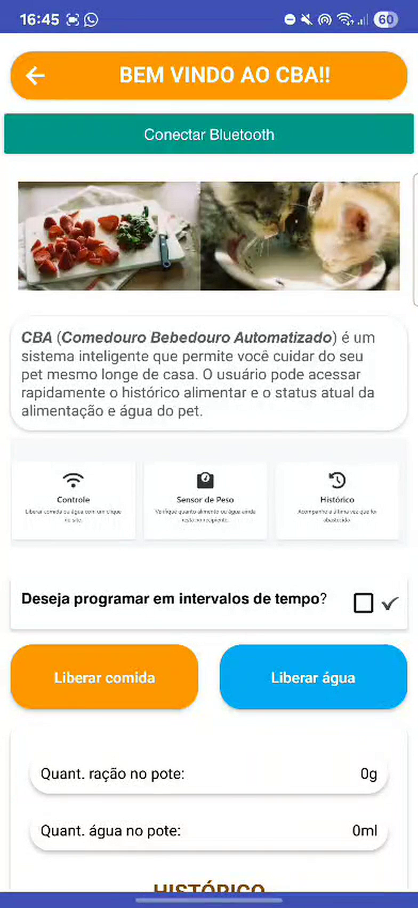
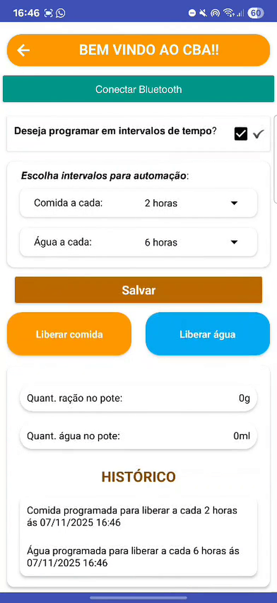
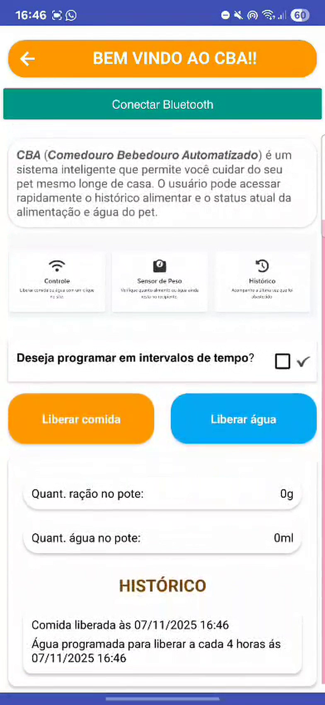

# Aplicativo do CBA

Aplicativo Android feito no **Kodular**, que conversa com o Arduino por Bluetooth.

## O que dá para fazer no app

- Conectar ao CBA pelo Bluetooth
- Liberar comida e água na hora
- Programar intervalos automáticos (ex.: comida a cada 2 horas, água a cada 4 horas)
- Ver a quantidade de ração (g) e de água (ml) nos potes
- Ver o histórico de liberações

## Telas

<table>
  <tr>
    <td align="center"> Tela inicial</td>
    <td align="center"> Programar intervalos</td>
    <td align="center"> Histórico</td>
  </tr>
</table>

## Arquivos

- `.aia`: projeto do Kodular. Para abrir, entre no [Kodular Creator](https://creator.kodular.io) e use **Projects → Import project**.
- `.apk`: instalador do app para celulares Android.
